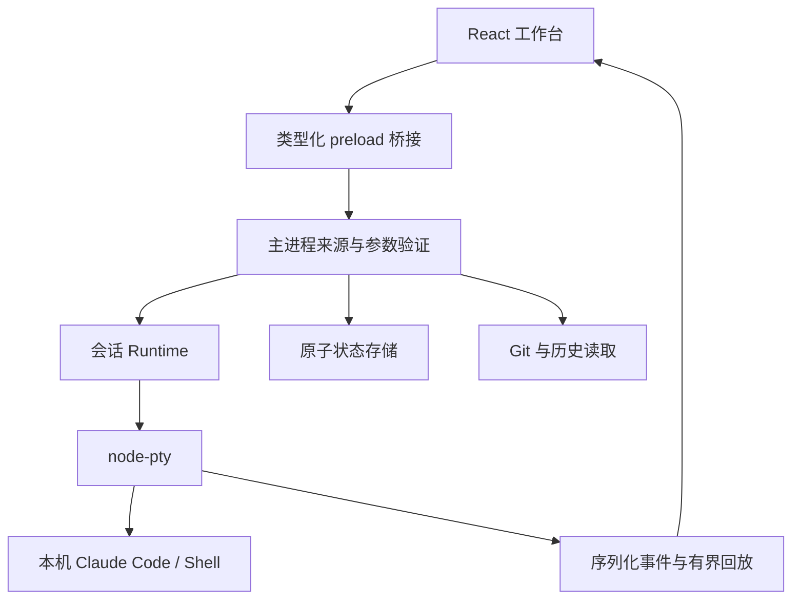

# 架构

## 数据流

## 边界

- UI 只处理视图、设置、终端和用户事件，不直接访问文件系统或执行命令。
- preload 暴露明确方法，不暴露 ipcRenderer、通配 invoke 或 Node 模块。
- main 验证 sender、主 frame、本地页面 URL、Zod 参数、会话 ID。窗口不接受外部导航和弹窗。
- Runtime 是 PTY 唯一拥有者，负责启动互斥、并发计数、输入、输出、尺寸、退出、重放。
- 参数数组直接传给可执行文件；Windows 的标准 npm CMD shim 解析成 node.exe + 固定 cli.js，不通过 cmd.exe 插值。
- Windows 停止使用 taskkill /T /F；POSIX 收集子进程 PID 并发送 TERM，随后 KILL 清理。独立于父进程自行 daemonize 的外部服务不在客户端拥有的会话进程树范围内。
- Claude 对话持久化由 CLI 管理。工作台只保存恢复该对话所需 UUID 与非秘密元数据，不写入 Claude JSONL。
- 状态使用 clone → validate → 临时文件写入/fsync → backup → rename。写失败不提交内存状态。损坏文件阻止启动而不是自动覆盖。
- PTY 输出每 24ms 合并一次，每会话内存约 1 Mi 字符，磁盘当前/前一份日志各约 5 MiB。xterm 每会话滚动行数可配置。
- 终端先订阅再获取快照，以单调递增序号去重，解决切换时的回放与实时输出竞态。
- 启动期间有独立计数，防止并发点击突破限制；退出期间拒绝新启动。

## 适配 CLI 版本

主要使用官方公开参数 `--session-id`、`--resume`、`--fork-session`、`--model`、`--permission-mode`、`--effort`。检测缺少必要 flag 时显示错误，不偷偷降级为新会话。CLI 帮助支持某个 effort 不代表当前所选模型支持，该部分由 CLI 返回最终错误。

终端模式无需维护 stream-json 的内部审批协议，也不需要客户端代理登录。代价是界面无法可靠知道模型回合结束、当前 token 计数或 TUI 内切换的会话 ID；界面不通过启发式猜测这些状态。

## 数据与凭据

workspace.json 不接收 API Key。继承运行环境与本机 Claude 配置，提供 CLI 路径配置以应对 GUI PATH 不完整。日志是本地原始终端内容，请按本地开发日志管理。

## 测试

测试使用临时目录与临时 Git 仓库。桌面 E2E 只在非打包程序中显式启用临时测试目录时跳过系统单例套接字；发行版本始终启用单例。Linux 容器测试所需 `--no-sandbox` 仅出现在测试启动参数中，不在应用代码或正式启动脚本中。
