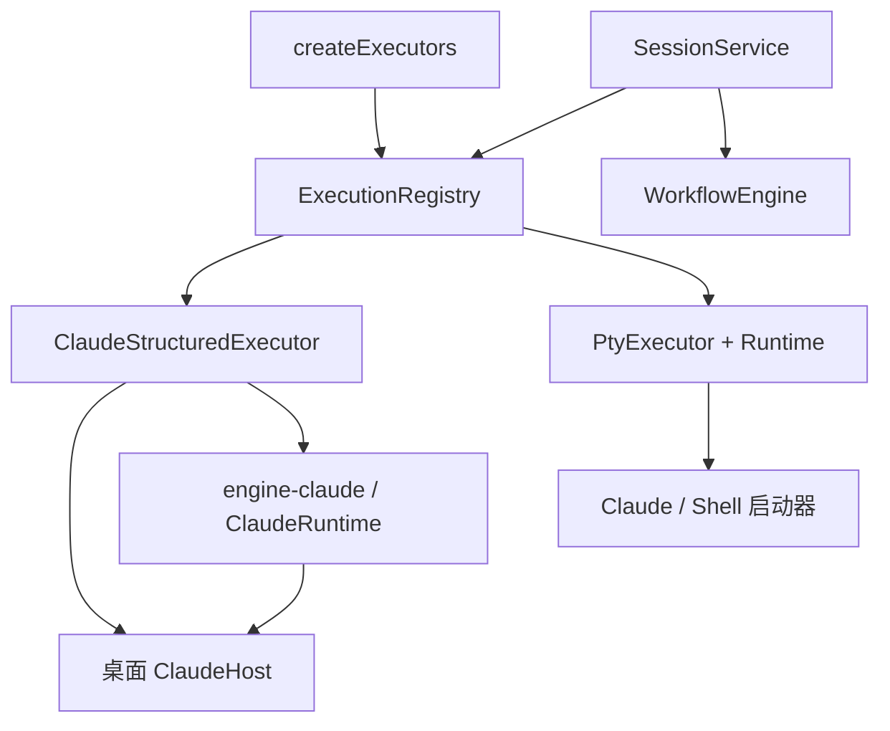

# 架构与边界

## 工作区结构

仓库由 npm workspaces 管理，根目录维护唯一 lockfile 和统一命令。`apps/desktop` 包含 Electron main/preload、React、桌面测试和打包配置，保留现有应用名称、appId 和数据位置；`packages/contracts` 输出平台中立的 ESM 与类型声明；`packages/engine-claude` 提供 Claude runtime、协议、CLI 参数、transcript 与专属配置。内部包保持 private，桌面构建将所需运行代码编入现有 CJS/renderer 产物，安装包不依赖仓库的 workspace 链接。

公共契约包含执行身份、`EngineConfig`、能力与描述、聊天消息、审批、事件、`SessionStatus` / `TerminalChunk`，以及 `execution-ports` 中的公共执行生命周期、结构化和终端接口。桌面 `shared/execution.ts`、`chat.ts`、`execution-events.ts` 与 `main/execution/ports.ts` 保留单向再导出；依赖桌面 Session 的注册与装配接口、存储、共享 PTY、字体和主题仍在 desktop。Claude 配置语义属于 engine-claude。根 `build/typecheck/test/dev` 先构建 contracts/engine-claude 与 agent-core/agent-node，再准备 desktop；公共包不得反向导入 desktop 源码，engine-claude 不依赖 Electron。

桌面源码和配置位于 `apps/desktop/`；下文 `src/` 路径均相对此工作区，`packages/` 路径相对仓库根目录。根目录保留 `docs/`、`release/` 和 `test-results/`。当前源码使用 workspace v3 与按引擎维护；实现映射、迁移回退和固定候选验收见 [阶段二实现与验收记录](ENGINE-BOUNDARIES-PHASE-2-VALIDATION.md)，阶段要求见 [阶段二计划](ENGINE-BOUNDARIES-PHASE-2.md)。

## 主进程与隔离

Electron main 是文件、进程、设置和 IPC 的唯一入口。renderer 无 Node 权限；preload 只暴露类型化方法；每次调用校验发送窗口、主 frame、来源与 Zod 输入。拒绝任意导航和窗口弹出；网页权限默认拒绝，仅允许可信主 frame 为系统字体列表申请 Local Font Access。

SessionService 统一仲裁终端与结构化运行器，管理全局并发、生命周期锁、目录锁、配置、附件、导出和工作流。启动、删除、改配置和 Worktree 操作的锁跨越 await，避免检查后状态改变。进程存在与回合忙碌分别判定；目录操作先持锁确认没有真实任务，再等待空闲结构化进程退出。审批、后台任务、工作流及仍打开的 PTY 继续阻止目录操作。容量不足时可回收空闲结构化进程，回收后重新检查锁和并发额度。

阶段三新增 DirectoryExecutionCoordinator：Git worktree 根和 canonical cwd、非 Git 项目根按同根/父子关系互斥，覆盖 Claude/native/Shell。executor 的物理释放与队列回执、workflow 跨阶段所有权分别等待；清理失败与未知副作用继续阻断目录。这只是应用登记根的协调，不是 OS 沙箱，也不覆盖外部程序或任意命令的全部影响。

## 公共会话身份与执行契约

`Session.kind` 区分 `agent` 与 `shell`；`Session.execution` 是唯一的后端身份，不再并行保存 `claudeId`、`resumeFrom`、`imported`、`adapter` 顶层字段。`Session.engineConfig` 是唯一的执行配置来源，不再双写顶层 `model`、`effort`、`permissionMode`。

| 字段 | 职责 |
| --- | --- |
| `Session.id` | 稳定的本地 UUID；用于日志、附件、草稿、选中状态与工作流关联 |
| `execution.providerId` | 执行提供方命名空间；当前注册 `claude`、`native` 和 `shell` |
| `execution.mode` | `structured` 或 `terminal`，决定所需执行接口 |
| `execution.conversationId` | 提供方的当前对话 ID；可以因 `/clear` 等已确认操作改变 |
| `execution.forkFrom` | 尚需恢复或分支的来源对话 ID，与当前对话 ID 分开 |
| `execution.imported` | 此会话是否导入已有提供方对话 |
| `engineConfig.schemaVersion / options` | 带版本的提供方配置；通用层限制 JSON 边界，适配器校验版本和字段语义 |

`getSessionIdentity` 将本地 `sessionId` 与执行身份组合成事件 DTO；同一原生对话的并发占用按 `providerId + conversationId` 判断，不把不同提供方的相同字符串视为同一对话。无对话 ID 的 Shell 不参与此互斥。公共 schema 接受有界的 opaque 对话 ID；Claude 的 UUID 要求由 Claude 适配器单独验证，未注册提供方的已保存身份仍可载入，不会静默切换到 Claude 执行。

`StructuredExecutor` 声明发送回合、审批、命令目录、快照、分页、搜索、配置与导出；`TerminalExecutor` 声明启动、写入、调整尺寸、快照与导出。两者共用 `ExecutionLifecycle` 的占用、忙碌、中断、停止、空闲释放、维护和关闭操作；共享物理执行器通过 `setSessionMaintenance` / `disconnectSessions` 支持按会话维护。`send` 必须等待真实回合结果，写入 stdin 不代表任务完成；进程树和句柄未释放时仍应计入占用。

`ExecutionCapabilities` 按功能声明 `structured`、`terminal`、`approvals`、`resume`、`fork`、`commands`、`contextUsage`、`liveConfig`、`attachments`、`recoverContext`、`export`，并独立提供 `available` 与错误信息。主进程路由在发送、启动终端、读取命令、审批、附件和动态配置入口检查对应能力；驻留连接也不能绕过命令能力校验。已有审批可在新的可用性检测失败时继续应答，但目标维护、取消和过期运行不能沿用旧审批。IPC 校验不依赖按钮是否隐藏。

`Snapshot.executors` 提供名称、模式、能力、配置字段/defaults、外部历史入口与维护状态；CLI 检测、设置或维护变化时通过 `workspace:executors` 刷新 renderer。`settings.engineDefaults` 按 provider 保存新会话默认配置，创建时物化到会话；之后改变默认值不覆盖既有会话。配置修改由适配器逐项提交已确认生效的值，后续操作失败不能用旧快照覆盖已成功修改的部分。Claude 模型、effort、权限和 CLI flags 保留其专属语义。

创建或导入元数据不要求执行器当前在线，以保留离线创建及已有记录访问；仍要求已注册执行器、有效配置与身份，并拒绝处于维护中的目标 provider。Claude 恢复与分支的实际启动继续校验对应 CLI flags。外部历史导入由注册的历史来源及描述中独立的 `history` 能力决定，不能从 `resume` 推断。

## 组合与提供方适配器

`index.ts` 调用 `execution/create-executors.ts`，在此创建注册表、具体执行器和终端启动器，再将注册表注入 `SessionService`。服务层不构造 Claude runtime；`StructuredExecutions` / `TerminalExecutions` 按已保存身份路由。外部历史通过 `HistorySources` 按 provider 注册、查询和校验导入，工作区查询与诊断通过 `WorkspaceQueries` 注入。当前产品仍运行本机 Claude Code CLI 和 Shell，默认创建 Claude structured；测试中的其他提供方只验证接口可替换性，不提供正式 native 入口。

Claude 结构化适配器通过桌面 `ChatRuntime` 薄装配类调用 `packages/engine-claude/src/runtime.ts` 中的 `ClaudeRuntime`；连接、协议事件、流式助手块去重和 transcript 水合也归 engine-claude。桌面 `engines/claude/host.ts` 注入窄的 `ClaudeHost` 端口，包括会话运行投影与补丁、展示历史/归档、子任务、启动环境、容量和进程组信号；包不访问整个 `StateStore` 或 Electron。历史端口保留受控可变投影与持久化 flush 屏障，关键写入失败必须传回运行器，界面观察者异常不改变执行结果。

stdin/stdout 使用 NDJSON；以 initialize 建立控制通路，使用 can_use_tool 请求、control_response、interrupt、set_model 和 set_permission_mode。拆包、粘包、异常 JSON 与大小限制仍由 Claude 协议层处理。

通用 PTY Runtime 留在 desktop，只接收 `TerminalLauncher` 准备好的可执行文件、参数、环境与启动资源。Claude 包生成 CLI 启动信息，桌面薄启动器接入会话补丁；Shell 启动器负责系统 Shell。两种终端注册共享同一个 `PtyExecutor`，继续共享容量和进程所有权；全局计数与 shutdown 按物理执行器对象去重。

CLI 更新调用 `withEngineMaintenance('claude')`。服务先关闭目标准入并推进取消代次，再暂停 Claude 队列、失效 Claude 工作流 token，并等待目标 admissions、队列 completion、工作流所有权和执行器资源。注册表保存本次原始 driver/会话范围，共享 PTY 只停止选定会话并等待其 prepare、stopping、hooks 和清理；已被删除的会话也不会妨碍解除原 driver 的维护屏障。专属于单一 provider 的驱动可复用其全量维护/断开方法，跨 provider 共享驱动缺少按会话方法时明确拒绝维护。保存或停止失败会取消安装，但不能跳过其他目标的清理。

Shell 和其他引擎的队列、工作流及终端交互不因 Claude 更新暂停，仍受正常容量和跨引擎目录管理保护。异步创建、附件、命令准备和队列操作在等待后重检准入与代次，维护前的旧操作不能在维护结束后迟到启动。维护完成后原 Claude 任务保持停止，队列和工作流需手动继续；记录阅读、导出、普通草稿与停止/取消在维护期间仍可用。

全局退出清理所有引擎，维护 finally 不会清除 quitting。退出请求使尚未进入安装阶段的更新失效；`updating` 阶段正常退出会提示等待安装及检测刷新结束，避免主动终止安装写入。更新命令自身仍保留既有超时与进程树清理。具体交互见 [CLI 更新说明](CLI-UPDATES.md)。

CLI 和 Shell 均使用独立参数启动，不拼接 shell 命令。会话显式选择 Bypass 时以 `--permission-mode bypassPermissions` 启动；空闲进程切入或退出 Bypass 时停止进程并在下一轮恢复，其他模式不会预先启用 Bypass。审批和交互提问继续交由用户处理。

协议实现依据 Anthropic 官方 Agent SDK 的控制消息结构；没有引入 SDK 认证页面或改写用户凭据。真实 CLI 的控制握手与协议 fixture 测试分别记录。模型账号验收属于另一层。

每个结构化会话只允许一个进行中的用户回合。工具、主回复、子任务分别追踪；以 result 判定回合结束，后台任务未完成时不直接推进工作流。进程退出、协议错误和控制超时均显示明确失败。审批由进程和 request_id 共同拥有，保持原始工具输入，取消/退出后立即失效。

空闲回收保留已完成 / 失败 / 中断的回合结果和 Claude 身份，不伪造一次中断。renderer 使用回合和子任务状态显示操作，不以常驻进程替代任务状态；底栏分别展示执行任务和连接进程。输入区以 Enter 发送，Ctrl / Cmd / Shift+Enter 换行；组合输入和重复 keydown 不发送，本地发送锁覆盖 IPC 接受之前的窗口。原生编辑器的直接发送要求已同步空闲状态及括号粘贴能力，以一次有序 PTY 写入发送文本和回车，不改变终端本身的键盘映射。

会话 `titleSource` 区分待自动命名、已自动命名和手工名称。新建空白 Claude 名称等待首条有效自然语言消息，由共享的本地纯函数提取短标题，结构化发送和原生已认证 UserPromptSubmit 使用同一规则。工作流单独传入用户目标作为命名依据，模型仍收到完整阶段指令。显式改名将来源设为 manual；旧记录无来源字段按手工名称保留，导入、分支和 Shell 不自动改名。命名不添加模型请求、不改写提示词或 transcript、不移动 worktree。

## 右侧工具窗口

`SessionInspector` 保留右侧竖向工具栏，以单一 `activePanel`（上下文、变更、工作流、诊断之一或 `null`）控制内容区，不再叠加整体显隐与多面板折叠状态。点击其他工具直接切换，点击当前工具、标题关闭按钮或面板内的 Shift+Esc 隐藏内容；关闭后焦点返回对应工具按钮，模态对话框保留自己的键盘处理。

当前会话已访问过的工具内容保持挂载，隐藏时退出焦点与可访问区域，Git 后台刷新暂停；切换工具不重新挂载聊天或终端。会话切换按会话 ID 重建工具内容，工作流和审阅草稿仍通过原有会话草稿存储恢复，尚未保存的会话配置不跨会话保留。

`cc-desk.inspector-active-panel` 单独保存工具选择或显式空值。旧整体隐藏、无打开面板或全部折叠迁移为仅显示工具栏；旧多面板布局只选择工具栏顺序中首个可见面板。有效的新设置优先，存储失效不阻止当前窗口交互。

## 消息图表

MessageText 识别 Mermaid 代码围栏，源码与本地图表独立切换。Mermaid 及图表类型按需加载；临近可视区域并展开所属详情后才渲染，流式更新等待 250 ms。初始化配置与渲染串行执行，过期结果取消提交，临时测量容器始终清理。主题变更重新渲染，源码复制保持原始文本。

渲染使用 Mermaid strict 模式，锁定宿主安全及主题配置，禁用 HTML 标签和链接绑定；SVG 再经 DOMPurify 过滤并移除外部资源引用，保持现有 CSP。源码上限 32,000 字符、边数上限 300、输出 SVG 上限 2 MiB，超限时保留源码入口。配置语义见 [Mermaid 官方文档](https://mermaid.js.org/config/schema-docs/config)。代码复制通过只写文本的受校验 IPC 调用系统剪贴板，最多 4 MiB UTF-8；不开放剪贴板读取或网页权限。

## 外部 IDE

应用路径保存在本机工作台设置中，旧配置迁移为空值。原生应用选择器只更新设置草稿，保存后生效。打开请求仅传项目或会话 ID，主进程从已保存状态确定目录，隔离会话使用自身 cwd。启动前检查目录、应用类型及权限；路径失效不影响工作台加载，可在设置中重新选择。

Windows 使用指定 .exe，macOS 应用包通过 `/usr/bin/open -a` 交给 LaunchServices，其他可执行文件直接启动。应用路径和目录使用独立参数，`shell: false`；不解析 CMD/BAT、快捷方式或命令字符串。启动环境清除工作台和 Electron 专用标记，编辑器进程独立运行，不计入 Claude 会话并发或随会话停止。

## 数据与恢复

工作区元数据使用版本 3 JSON。`persistedStateSchema` 仅在读盘时兼容版本 1/2；`workspace-v2.ts` 保留旧格式读取规则。v1 先将 `kind: claude` 与旧身份字段转换为 `kind: agent` 和单一 `execution` 对象；旧 Shell 变为不含对话 ID 的终端身份，缺少模式时沿用 terminal 默认值。随后将 Claude 顶层配置原值移入 schemaVersion 1 的 `engineConfig.options`，旧默认权限移入 `settings.engineDefaults.claude`。Shell 的非默认旧值保存在 `options.legacy`；其他旧 provider 的配置保存为 schemaVersion 0 兼容载荷，不赋予 Claude 语义。

迁移保留本地会话 ID、历史、草稿、选中状态、worktree 路径和未确认身份标记，不重命名日志或附件存储键。读取只完成内存迁移，首次 flush 或状态写入前，独占创建并同步 `workspace.pre-v3.<UUID>.json`，保留原始 v1/v2 文件内容；成功后才写临时 v3 文件、fsync、滚动备份和 rename。固定迁移快照不会被后续保存覆盖，`workspace.json.bak` 则继续滚动更新。实时修改只接受 v3 schema，不双写顶层旧配置；损坏或未来 workspace 版本会报错并保留原文件，不写空状态。重启把活动进程和回合标为停止/中断。跨版本回退须退出应用、保全整个数据目录，再恢复明确的旧格式快照或完整备份，详见[阶段二迁移与回退](ENGINE-BOUNDARIES-PHASE-2-VALIDATION.md)。

v3 可保留符合通用 JSON 边界的未知 provider 和配置版本。执行入口拒绝缺失适配器或不支持的配置，不切换到 Claude；结构化会话的 snapshot/page/search 可通过 `OfflineHistory` 读取宿主已有展示日志。离线投影不调用执行器 hydrate、不补读 Claude transcript、不恢复活跃审批、命令或队列；无本地日志时明确提示。P2 不承诺缺失适配器时仍可导出、删除或完整管理该会话，普通草稿等纯保存入口与执行权限分开。

ChatHistory 保存有界 UI 快照和追加式完整工作台事件日志。`ChatJournalEvent` 使用通用消息、文本增量、状态、用量、结果和审批 DTO，不暴露 Claude 原始协议帧。Claude 路径先成功追加本地事件日志，再发布相应的 `ExecutionEvent`；写入失败不会先广播该条记录。身份变化、会话状态、聊天变化与终端输出也通过同一事件通路交给服务层。

`SessionService` 订阅归一化事件后触发界面刷新和通知，同时保留已有 chat/terminal IPC。`onExecution` 提供公共订阅；其中 journal 的 message/text_delta 不推送到 renderer 事件队列，正文由快照、分页和检索读取，避免大消息在通知通路重复堆积。观察者异常与执行生命周期隔离。权限请求不跨进程恢复。CLI 原始 JSONL 仍归 CLI 所有。外部历史查询及分页游标携带 provider，Claude 的索引、解析和查询实现位于 engine-claude：按项目过滤后分页，元数据缓存以 mtime/size 失效，全文搜索流式读取匹配项目的文件，不额外复制原始全文数据库。界面忽略切换来源后迟到的查询结果。

工作流保存在独立的版本 1 JSON 文件中，包含固定会话/目录绑定、依赖、状态、次数和摘要产物；其格式版本与 workspace 版本独立。绑定增加 `providerId` 与 `executionMode: structured`，旧工作流读取时补为原有 Claude structured 绑定。每次继续或派发阶段都校验提供方、执行模式、项目与工作目录，不能在同一本地会话更换提供方后继续旧工作流。引擎仅通过 getSession、runStage、cancelSession 端口执行，业务层仍共享会话权限、并发和目录锁。取消优先于迟到成功；取消后直到执行器结束仍保留会话独占。重启不自动重放可能有副作用的步骤。

子任务活动作为独立的 `Session.subtasks` 投影随 workspace.json 原子保存，不依赖有界聊天消息窗口。结构化流和原生 PTY hook 适配器共用 SubtaskTracker：按轮次、来源及 task/tool/agent 标识关联，合并明确别名，保留不同 Agent 调用的身份；重放的开始 / 进度不能覆盖终态，后台启动确认不代表完成。每会话最多 200 条，先淘汰已结束记录并标注截断；实际 CLI 后台等待集合独立于展示上限。

任务观察采用已有延迟批量持久化与 workspace:state 通知。冷启动把未结束任务标为中断，保留已完成 / 失败结果；旧日志不进行自然语言回填。原生子代理 hook 仅更新自身任务记录，不能建立或覆盖主会话身份、模型与权限，不读取传入的 transcript 路径。Ctrl-C 只请求中断，子任务计数等待后续 hook 或实际进程退出确认。界面在对话和原生终端的输入区上方共用折叠任务面板，不依赖右侧面板是否可见。

## 文件、Git 与配置

项目文件接口拒绝绝对路径、穿越、Git 内部文件和指向项目外部的符号链接；Git 路径使用 literal pathspec。预览和 diff 有大小上限，二进制不当作文本展开。通过原生选择器或文件拖放添加的附件复制到私有目录，通过每会话 allowlist 校验后才能发送。拖放桥接仅接收浏览器提供的 `File`，由 preload 的 `webUtils.getPathForFile` 获取真实路径，不向 renderer 暴露任意宿主路径导入接口；虚拟文件不能作为本地附件导入。拖放阶段仅校验类型、大小并暂存副本，发送时才进入原有附件内容构建流程。

Worktree 所有权记录写入该 worktree 的 Git 私有目录。只允许快进合并；自动清理要求记录有效、无使用中的会话、已合并且目录干净，包含忽略数据检查。不 reset、不 force、不自动删分支。

删除会话的显式强制清理单独核验确认路径，并锁定登记路径及仍可解析的 Git 根目录，避免损坏或缺失目录在获取锁前抛错；正常合并和清理仍要求完整 Git 根目录。目标 `.git` 缺失时，以来源仓库登记、独立 Git 管理目录中的会话所有权、分支和目录连接记录核对，只对该目录独占创建缺失的连接文件，再由单次 `git worktree remove --force` 删除。不会覆盖现有异常连接、修复其他 worktree、批量 prune 或递归删除兜底；来源项目、Git 分支、锁定目录及嵌套仓库仍受保护。

新建位置由 `settings.worktreeLocation` / `worktreeRoot` 决定，旧设置默认使用项目内 `.claude/worktrees/`；统一目录按规范化项目名与规范 Git 根目录的短摘要分组。可选 `worktreeName` 留空时取规范化会话标题，再追加会话短 ID；分支仍为 `workbench/<id8>`，V1 所有权和已持久化的旧路径不变。来源与登记项目必须属于同一 Git 仓库，fork 的合并基准保留来源路径，目标位置按登记项目确定。

项目内创建拒绝已跟踪的保留路径、已有目标及受符号链接重定向的父目录；仅在 Git 本地 exclude 追加精确路径规则。创建与 Git 引用操作串行；项目内 fork 同时锁定来源和目标项目，直到会话持久化完成。失败仅回收本次预留的空目录，exclude 回滚比较原始字节以保留外部编辑。统一根目录允许尚未存在的路径，先解析已有祖先，再校验与项目和 Git 元数据的边界。位置选择器只返回目录，不添加项目；新设置不触发迁移。

诊断仅提供配置存在性、来源、MCP/Skills 元数据和公开认证状态。密钥值、HTTP headers、命令参数、账户标识和原始错误不会经过诊断 IPC。配置存在、认证成功、MCP 运行和模型服务可达分别表达。

## 文件职责与扩展入口

| 路径 | 职责 |
| --- | --- |
| `packages/contracts/src/` | 公共身份、配置、能力、描述、聊天/事件 DTO 与 `execution-ports` 生命周期接口 |
| `packages/engine-claude/src/` | Claude runtime、协议、配置、CLI 参数/探测、transcript、hooks 与宿主端口声明 |
| `src/shared/execution.ts`、`execution-events.ts` | 公共契约单向再导出，保持桌面消费入口 |
| `src/shared/{types,schema,workspace-v2}.ts`、`src/main/store.ts` | workspace v3、旧格式读取、配置边界与固定迁移备份 |
| `src/shared/session-commands.ts` | 提供方无关的斜杠输入与命令匹配 |
| `src/main/execution/` | 公共端口再导出、桌面注册表、路由、事件通路、历史来源/离线读、组合与通用终端适配器 |
| `src/main/engines/claude/` | Claude 桌面 host、会话投影/补丁、能力与身份校验、启动及导出薄适配 |
| `src/main/engines/shell/` | Shell 启动实现 |
| `src/main/session-service.ts`、`session-creation.ts` | 会话仲裁、锁与创建事务 |
| `src/main/runtime.ts`、`chat-queue.ts` | 共享 PTY 生命周期、目标资源清理、持久化消息 FIFO 与完成所有权 |
| `src/main/ipc/` | 按会话、聊天、工作流、工作区职责注册经过校验的 IPC |
| `src/main/workflows.ts`、`workflow-schema.ts`、`workflow-storage.ts` | 阶段调度、状态/依赖验证、原子存储 |
| `src/renderer/App.tsx`、`EngineConfiguration.tsx`、`workspace/` | 描述/能力驱动的入口与配置、工作区组件、草稿、记忆和外观 hooks |

接入新的执行器时：

1. 在提供方包实现运行协议，通过 desktop 的 `engines/<provider>/` 薄适配接入公共 `StructuredExecutor` 或 `TerminalExecutor`；PTY 提供方可复用 Runtime，并实现 `TerminalLauncher`。协议、凭据和提供方身份约束留在适配器内。
2. 在组合入口按 providerId/mode 注册实现、能力、配置描述/默认值与 `validateConfig`，提供身份分配 `createIdentity` 和必要的 `validateSession`。会话使用带版本的 engineConfig，远端身份不能借用 Claude UUID 规则。外部历史另行注册提供方来源，声明支持的导入能力。
3. 通过公共事件通路发布已保存事件与状态；准确区分活跃进程、进行中回合和后台任务，保证 stopIdle / disconnectSessions / disconnectAll 返回时相应资源已释放或明确失败。共享物理执行器必须实现按会话维护，不能通过全局断开影响其他 provider。
4. 以非 Claude 测试执行器经过真实 SessionCreation → SessionService → IPC 验证独立配置、发送、审批、取消、队列、多阶段工作流、身份互斥和 scoped 维护；再验证实际协议适配。目录管理测试须覆盖其他引擎及关闭中的资源，不能通过 provider 筛选绕过保护。

当前 monorepo 已建立公共契约包和独立 Claude 包，尚未新增正式模型提供方、内置 native Agent、网络执行协议或插件装载器。真实 native 的模型调用、工具循环、检查点和完整恢复日志属于阶段三，不能用宿主展示日志代替。新增后端仍需完成自身执行实现、能力验证与产品入口。

## 后续演进

SQLite 持久化全文索引、MCP 配置编辑/验证、后台服务、签名更新、远程环境属于后续工作。当前托盘只维持本机 Electron 进程；机器休眠、断电或退出应用不能继续运行任务。

## Native Alpha

`agent-core` 不依赖 Node/Electron；`agent-node` 提供 Responses、持久记录、工具和监管；desktop main 拥有权限、目录与副作用。每回合真实 utilityProcess 执行 core/模型，使用带 run/generation/seq 的受限 RPC。完整模型上下文位于 native 账本，ChatHistory 仅是可重建展示投影。`ExecutionSubmission` 贯通直接提交、队列消息及 workflow attempt，`stopAndWait/whenReleased` 等待物理清理，`recoveryRequired` 阻断跨引擎冲突目录。设计和数据路径见 [操作与实现说明](NATIVE-AGENT-ALPHA.md)，实际验证范围见 [阶段三验收](NATIVE-AGENT-PHASE-3-VALIDATION.md)。
