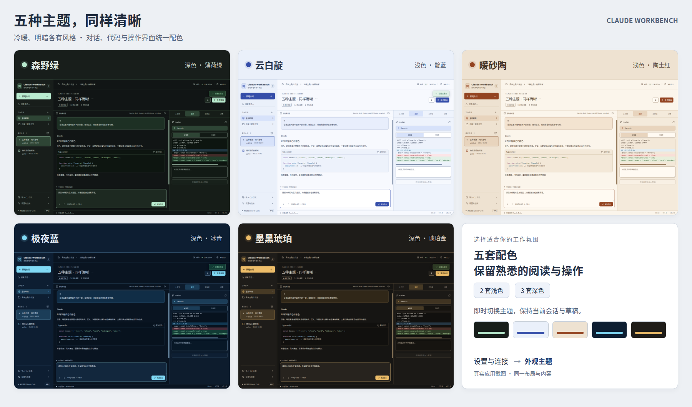
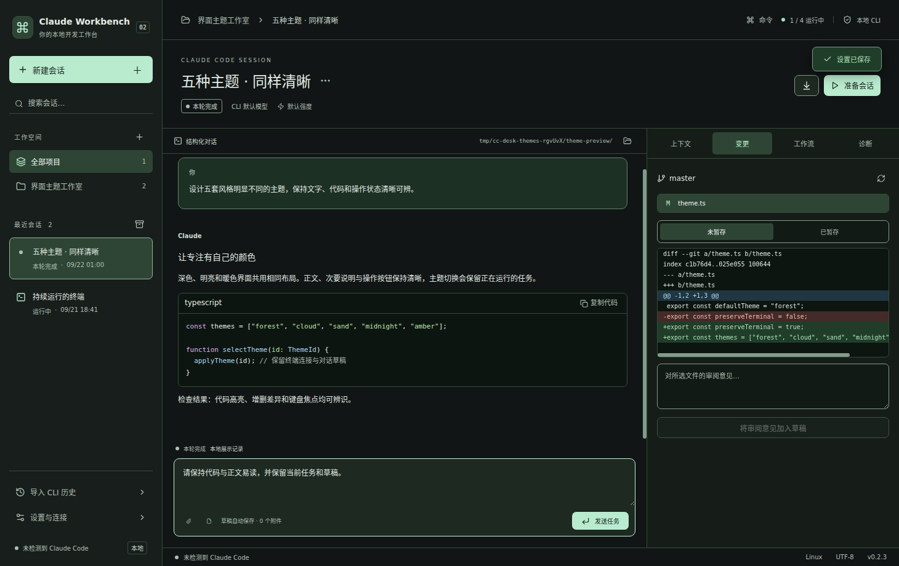
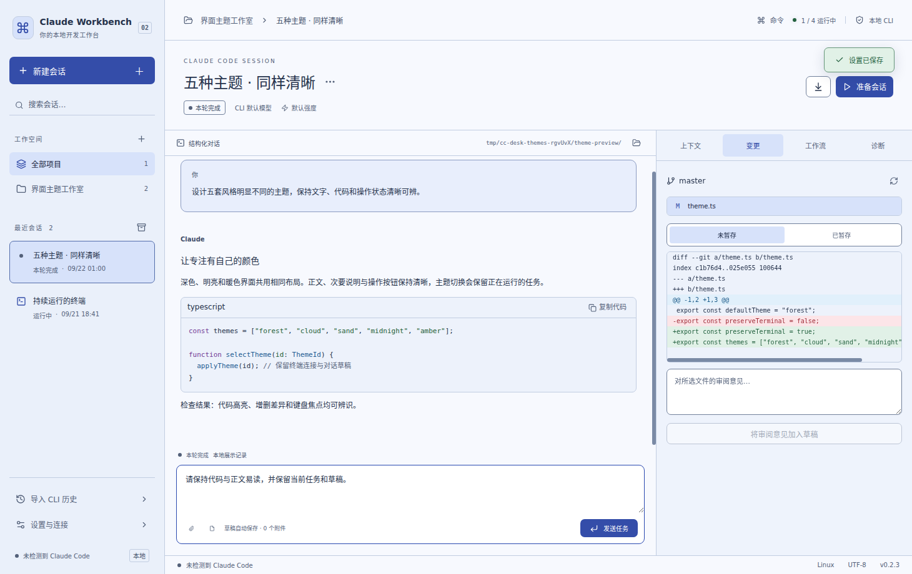
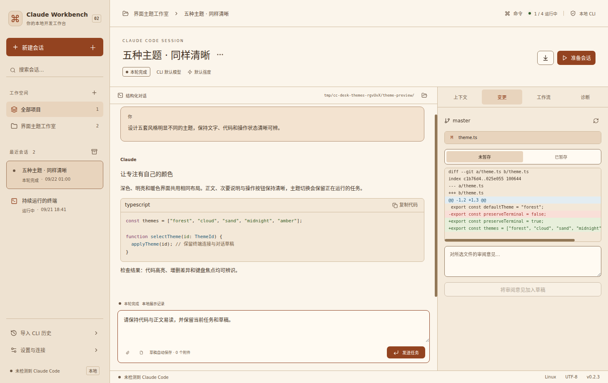
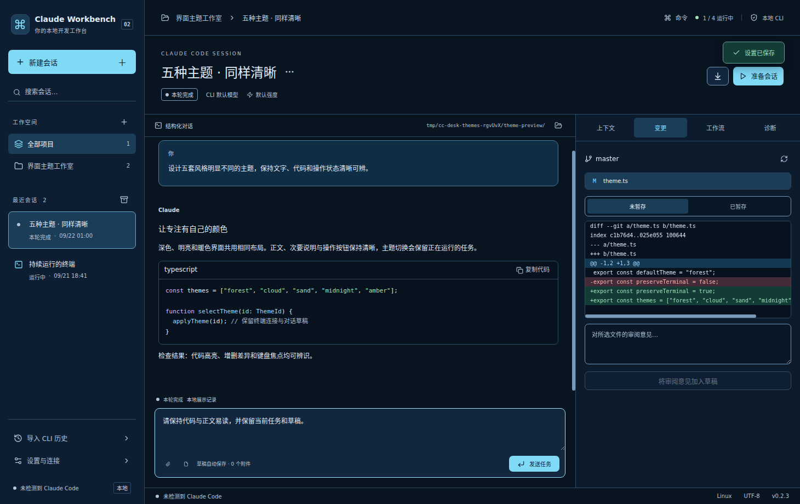
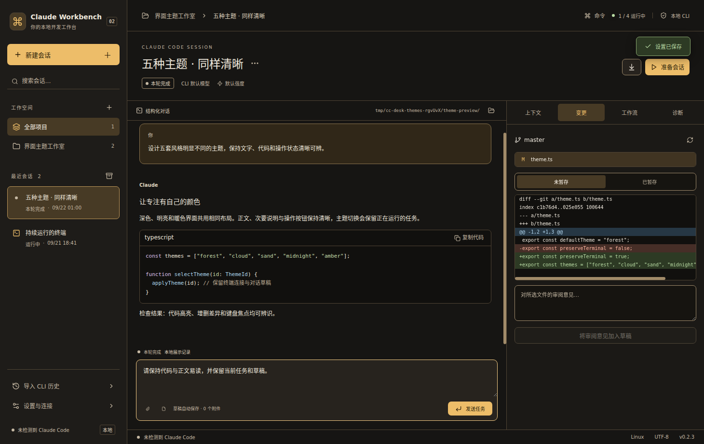

# 五套工作台主题

从 v0.2.3 开始，在「设置与连接 → 外观主题」选择。点击即时预览；「保存设置」后保留，关闭弹窗可取消未保存的预览。旧工作区默认使用森野绿。

| 主题 | 风格 | 主背景 | 强调色 |
| --- | --- | --- | --- |
| 森野绿 | 深墨绿、薄荷色；安静、自然 | `#111515` | `#B9EBCF` |
| 云白靛 | 冷白、雾蓝层次、靛蓝操作按钮；明亮、清爽 | `#F7F9FE` | `#344DA9` |
| 暖砂陶 | 奶油纸面、暖砂层次、陶土红；温暖、柔和 | `#FBF5EB` | `#934320` |
| 极夜蓝 | 深海藏蓝、冰青高光；冷静、利落 | `#091421` | `#80D9F5` |
| 墨黑琥珀 | 炭黑、烟棕层次、琥珀金；沉稳、醒目 | `#161513` | `#EDBD69` |

## 阅读和操作规则

- 两套浅色、三套深色，分别设计页面、侧栏、面板、悬停、选中、输入框、代码、弹窗和终端颜色。字体、布局和操作位置保持一致。
- 正文、次要说明、输入提示、按钮文字、代码语法及状态内容使用明确的前景/背景组合；自动检查至少 4.5:1。焦点、关键控件边界和滚动条检查至少 3:1。计算依据为 [W3C 文字对比度](https://www.w3.org/WAI/WCAG22/Understanding/contrast-minimum) 与 [非文字对比度](https://www.w3.org/WAI/WCAG22/Understanding/non-text-contrast.html)；这些是配色检查，不等于完整的无障碍认证。
- 成功、警告、错误和提示各有独立颜色；审批标题、状态文字、图标、Diff 的 `+`/`-`、选中标记继续保留，不单靠颜色表达含义。
- 终端同步切换背景、文字、光标、选区和 16 色调色板；对 CLI 的 256 色/真彩色输出启用 xterm 最低对比度保护。主题切换不重建终端、不重启进程、不清空输出或草稿。
- 原生窗口背景和系统控件明暗随已保存主题设置；启动使用已保存的外观。只改主题不触发 CLI 重新检测。

## 实际界面预览

截图使用同一份本地演示对话、代码和 Git diff，便于直接比较。终端测试使用真实 Shell，不调用模型。

### 森野绿

### 云白靛

### 暖砂陶

### 极夜蓝

### 墨黑琥珀

## 维护与校验

主题 ID 和原生窗口底色位于 `src/shared/theme.ts`；调色板在 `src/renderer/themes.ts`；CSS 变量在 `themes.css`，组件样式在 `style.css`。`tests/themes.test.ts` 同时验证颜色对比度、CSS 与调色板一致性、未知主题回退及所有颜色变量完整性。

`tests/themes.spec.ts` 覆盖旧数据默认主题、五套主题预览/保存、取消恢复、重启持久化、运行中终端实例和 Shell 变量保留、切换后继续输入、草稿与对话保留，以及实际页面颜色和焦点检查。跨平台结果见本版 Release 关联的 CI。
