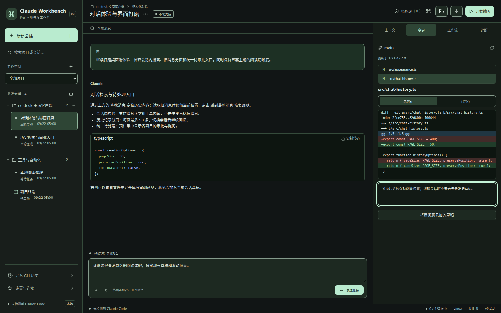

# 项目分组与紧凑对话布局

根据界面反馈，最近会话改为项目分组，对话顶部合并为一个紧凑标题栏。改动属于待发布的 v0.2.3 源码。

## 使用方式

- 侧栏按“项目 → 会话”展示，项目标题可折叠，右侧数字是当前筛选下的会话数。项目内按最近更新时间排列，项目顺序保持稳定。
- 项目旁的 `+` 在该项目内创建会话；顶部“新建会话”继续优先使用筛选项目，否则使用当前会话所属项目。
- 搜索支持项目名称、会话标题和目录，输入时自动展开结果。归档记录也按项目分组；原项目已移除的会话保留独立分组。
- 待处理请求、系统通知和命令面板跳转会清除阻挡目标的筛选并展开所属项目。折叠及筛选不会关闭当前会话，也不会清空草稿。
- 顶部保留项目、运行方式、标题、当前状态以及常用操作，移除重复标题和独立目录行。工作目录可以从顶部文件夹按钮打开，在右侧“上下文”查看完整路径；模型与强度仍在上下文面板设置。
- 全局运行数量移到窗口底部。长标题显示省略号，可悬停查看全文，窄窗口保留常用操作。

## 实际截图

Linux Electron 实际渲染，1600×1000，使用示例项目、对话和 Git 差异；没有调用模型。Windows 使用相同界面代码，窗口系统外框可能不同。

同尺寸、无错误/同步横幅时，消息区上边缘从 286px 移到 108px，增加 178px 阅读空间。其中标题栏 72px，消息查找栏 36px。

已有本地桌面显示环境时，可以执行 `npm run build` 后运行 `node scripts/capture-layout.cjs` 复现截图；脚本使用临时项目和独立测试数据，结束时清理临时数据。

## 验证

TypeScript、生产构建通过；Node 测试 144 通过、1 项 Windows 专用测试跳过；Electron 8/8 通过。新增验证覆盖分组排序、折叠与检索、项目内新建、归档、旧项目会话、跨项目跳转、草稿保留，以及 1600×1000 / 980×680 下的长标题与按钮边界。五套主题和已有审批、终端、历史阅读流程回归通过。

源码推送使用 `[skip ci]`，未创建新版安装包或 Release。
